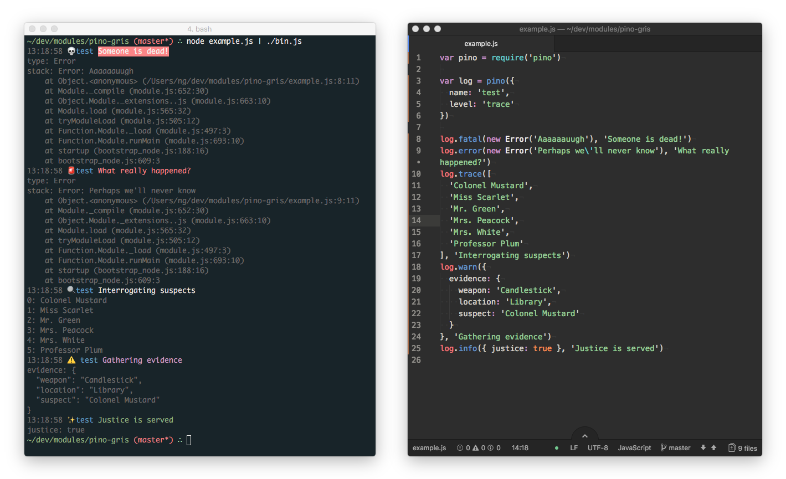

# pino-gris 🍇

[![npm version][1]][2] [![build status][3]][4]
[![downloads][5]][6] [![js-standard-style][7]][8]

A verbose [ndjson](http://ndjson.org) log formatter for [pino](https://github.com/pinojs/pino).



[1]: https://img.shields.io/npm/v/pino-gris.svg?style=flat-square
[2]: https://npmjs.org/package/pino-gris
[3]: https://img.shields.io/travis/ungoldman/pino-gris/master.svg?style=flat-square
[4]: https://travis-ci.org/ungoldman/pino-gris
[5]: http://img.shields.io/npm/dm/pino-gris.svg?style=flat-square
[6]: https://npmjs.org/package/pino-gris
[7]: https://img.shields.io/badge/code%20style-standard-brightgreen.svg?style=flat-square
[8]: https://github.com/feross/standard

**Note:** this is a fork of [`pino-colada`][pino-colada].
The main difference is that `pino-gris` does more verbose logging of objects.

## Install

```
npm install pino-gris
```

## Usage

Pipe any `pino` output into `pino-gris` for logging.

```bash
node server.js | pino-gris
```

After parsing input from `server.js`, `pino-gris` returns a stream and pipes it
over to `process.stdout`. It will output a timestamp, a log level in the form of
an emoji, a message, and any extra data supplied in the first argument.

```
> log.fatal(new Error('Aaaaaauugh'), 'Someone is dead!')

13:14:32 💀 test Someone is dead!

  type: Error
  stack: Error: Aaaaaauugh
      at Object.<anonymous> (/Users/ng/dev/modules/pino-gris/example.js:8:11)
      at Module._compile (module.js:652:30)
      at Object.Module._extensions..js (module.js:663:10)
      at Module.load (module.js:565:32)
      at tryModuleLoad (module.js:505:12)
      at Function.Module._load (module.js:497:3)
      at Function.Module.runMain (module.js:693:10)
      at startup (bootstrap_node.js:188:16)
      at bootstrap_node.js:609:3
```

The main difference between this and [`pino-colada`][pino-colada] is that it will output _any_ key attached to the `pino` log object that isn't included in the following list:

```js
const pinoKeys = [
  'level',
  'time',
  'msg',
  'message',
  'pid',
  'hostname',
  'name',
  'ns',
  'v',
  'req',
  'res',
  'statusCode',
  'responseTime',
  'elapsed',
  'method',
  'contentLength',
  'url'
]
```

These are all the keys that were already being processed by `pino-colada`. So anything that falls out of this list will also get printed.

This means error stack traces, objects, arrays, or anything else will get logged.

### Example Output

For live sample output, try running `npm start` in this repo.

```
> node example.js | ./bin.js

13:14:32 💀 test Someone is dead!

  type: Error
  stack: Error: Aaaaaauugh
      at Object.<anonymous> (/Users/ng/dev/modules/pino-gris/example.js:8:11)
      at Module._compile (module.js:652:30)
      at Object.Module._extensions..js (module.js:663:10)
      at Module.load (module.js:565:32)
      at tryModuleLoad (module.js:505:12)
      at Function.Module._load (module.js:497:3)
      at Function.Module.runMain (module.js:693:10)
      at startup (bootstrap_node.js:188:16)
      at bootstrap_node.js:609:3

13:14:32 🚨 test What really happened?

  type: Error
  stack: Error: Perhaps we'll never know
      at Object.<anonymous> (/Users/ng/dev/modules/pino-gris/example.js:9:11)
      at Module._compile (module.js:652:30)
      at Object.Module._extensions..js (module.js:663:10)
      at Module.load (module.js:565:32)
      at tryModuleLoad (module.js:505:12)
      at Function.Module._load (module.js:497:3)
      at Function.Module.runMain (module.js:693:10)
      at startup (bootstrap_node.js:188:16)
      at bootstrap_node.js:609:3

13:14:32 🔍 test Interrogating suspects

  0: Colonel Mustard
  1: Miss Scarlet
  2: Mr. Green
  3: Mrs. Peacock
  4: Mrs. White
  5: Professor Plum

13:14:32 ⚠️  test Gathering evidence

  evidence: {
    "weapon": "Candlestick",
    "location": "Library",
    "suspect": "Colonel Mustard"
  }

13:14:32 ✨ test Justice is served

  justice: true

```

### Nota Bene

Be careful how you use `pino`! It will do very different things depending on the order of arguments.

Example:

```
> log.error(new Error('error text'), 'message text')

{"level":50,"time":1523650090921,"msg":"message text","pid":63152,"hostname":"quant.local","name":"test","type":"Error","stack":"Error: error text\n    at repl:1:9\n    at ContextifyScript.Script.runInThisContext (vm.js:50:33)\n    at REPLServer.defaultEval (repl.js:240:29)\n    at bound (domain.js:301:14)\n    at REPLServer.runBound [as eval] (domain.js:314:12)\n    at REPLServer.onLine (repl.js:468:10)\n    at emitOne (events.js:121:20)\n    at REPLServer.emit (events.js:211:7)\n    at REPLServer.Interface._onLine (readline.js:282:10)\n    at REPLServer.Interface._line (readline.js:631:8)","v":1}

> log.error('message text', new Error('error text'))

{"level":50,"time":1523650105577,"msg":"message text {}","pid":63152,"hostname":"quant.local","name":"test","v":1}
```

In the first case above, the error's stack trace is merged onto the object, but the error's message is only visible in `stack`.

In the second case above, the error's stack and message properties are completely lost!

So if you want to preserve any important information from an object, always pass it first.

Also note `pino` will do weird things with key collisions, like so:

```
> log.trace({ v: 2 })
{"level":10,"time":1523650319601,"pid":63152,"hostname":"quant.local","name":"test","v":2,"v":1}
```

Notice there are two `v` keys above now! 🤔

## Related content
- [pino-colada][pino-colada]
- [pino](https://github.com/pinojs/pino)
- [merry](https://github.com/shipharbor/merry)
- [garnish](https://github.com/mattdesl/garnish)
- [@studio/log](https://github.com/javascript-studio/studio-log)
- [pino-http](https://github.com/pinojs/pino-http)
- [hapi-pino](https://github.com/pinojs/hapi-pino)

[pino-colada]: https://github.com/lrlna/pino-colada

## License
[MIT](https://tldrlegal.com/license/mit-license)
